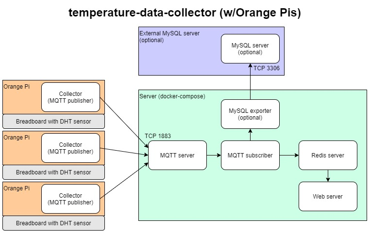

# temperature-data-collector
An application intended for a custom-built IoT device, to collect, process, and display temperature and humidity data from a digital temperature and humidity sensor (DHT)

This is an all-in-one project including collectors for various hardware platforms, a MQTT system (server, subscribers, publishers), Redis server, a MySQL exporter, and a web server to monitor live data.

Docker containers to be included:

### Client:

- Pi sensor collector (not Dockerized yet)

- Arduino sensor collector (not written yet)

### Server:

- MQTT server

- MQTT subscriber

- Redis server

- Node.js web server

- Optional application to write values to external MySQL database

## Hardware

### Board

- [Arduino MKR1000](https://store-usa.arduino.cc/collections/boards/products/arduino-mkr1000-wifi-with-headers-mounted)

OR

- Orange Pi (Zero)

### Sensor

- [DHT11 sensor](https://www.amazon.com/Temperature-Humidity-Digital-3-3V-5V-Raspberry/dp/B07WT2HJ4F/ref=sr_1_1?keywords=dht11+sensor&qid=1638560461&sr=8-1)

OR

- [DHT22 sensor](https://www.adafruit.com/product/385)

	- Recommended. DHT22s are much more accurate, for only a tiny bit more.

### Miscellaneous

- Breadboard

- Jumper wires

- 10k ohm resistor (pull-up)

### Circuit diagram

[Image source](https://osoyoo.com/2017/07/19/arduino-lesson-dht11-sensor/)

## Process:

There are two components: Client, and Server.

Client is the code in the collector directory. This can only run standalone for now, Docker support hopefully coming soon.

Server is everything else (web, redis, etc) and can be run via docker-compose (or each component standalone).

Client(s) send data via MQTT to the server. The subscriber then adds to redis and stores to the permanent database. The web server will read from redis.

Focusing on development for the Orange Pi Zero first, due to hardware availability.

## Getting Started

This system is still in development. Some things may not work.

The server must be runing first, or the client won't be able to make a connection to the MQTT server.

Server:

1. Clone this repository on your server

2. Ensure port 1883 is open on your server, for the client to send data over

3. Run `docker-compose up --build`

4. Hold tight! Still in development

Client:

1. Build the circuit in the "Circuit diagram" section above, with a 10k ohm resistor, DHT sensor, and Orange Pi. Have the data pin going to the proper GPIO port (the collector defaults to PA6)

2. On the Orange Pi, clone this repository and run collector/collector.py. Edit the script if you would like to change the sensor model, GPIO port, sample rate, etc.

3. You should get temperature and humidity values as output, and the data will be published via MQTT for the listening server.

## TODO:

For V1:

- Web server integration with Redis

- Basic Collector -> Listener -> Redis -> web server functionality

- finish setup script

- finish .env and docker-compose

For V2:

- Clean up and add Arduino code

- deploy Arduino code from setup script? Board setup via wifi?

- Dockerize client/collector

Note: For Arduino+MySQL, utilize this library: https://github.com/ChuckBell/MySQL_Connector_Arduino
